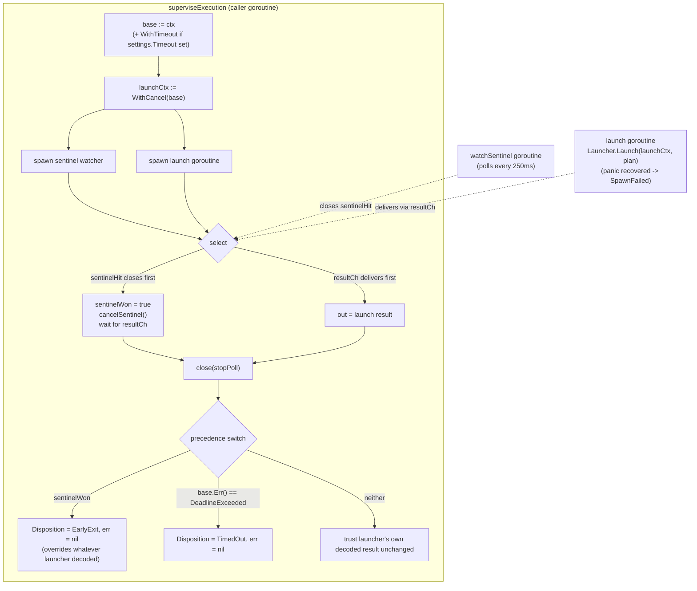

# Per-Attempt Supervision Race

> Part of: Execution & Evaluation Flow (Runner)

## Context

Runner's execution phase does not simply call the subject launcher and wait — it races three independent signals that can each explain the subject's run ending, and exactly one of them must be trusted as *the* reason, because the verdict engine downstream (`evaluate.Evaluate`) branches on disposition to decide pass/fail/timeout/state-integrity. Two of the three signals can produce observably identical evidence (a context cancellation looks the same to the launcher whether it was caused by the declared timeout or by the supervisor reacting to the early-exit sentinel), so a precedence rule is required, not just a race. This is dense enough — three goroutines, two `context.Context` layers, two independent panic-recovery points, and a precedence rule that only makes sense once you know what each signal *can't* distinguish on its own — that the domain-tier document (`ExecutionAndEvaluation/Index.md`) intentionally stops short of it and defers here.

## Behavior

### The three terminating conditions

One attempt's execution can end for exactly one of three reasons, each producing a distinct `domain.RunDisposition`:

| Condition | How it's detected | Resulting disposition |
|---|---|---|
| **Early-exit sentinel** | The supervisor itself polls for a file's existence (not a filesystem watch — notification semantics differ across platforms and a missed notification would hang the run indefinitely) | `DispositionEarlyExit` |
| **Declared timeout** | A `context.Context` deadline the supervisor itself created from `settings.Timeout` | `DispositionTimedOut` |
| **Harness-reported completion** | The launcher's own decoded result — either ordinary completion or the harness announcing its own turn limit in its output envelope | `DispositionCompleted` / `DispositionTurnLimit` (whatever the launcher decoded) |

### Goroutine structure

Three goroutines run concurrently for the duration of one attempt's execution:

1. **The caller's goroutine** — runs `superviseExecution` itself, blocking on a `select`.
2. **The sentinel watcher** — polls the sentinel path on a fixed interval, closing a `hit` channel the first time the file exists, and stopping as soon as a `stop` channel closes (signaled once the `select` resolves, by either path).
3. **The launch goroutine** — hands the plan to `domain.SubjectLauncher.Launch` and delivers its result through a buffered channel. Wrapped in its own panic recovery: a panic here becomes a synthesized `DispositionSpawnFailed` result plus an error delivered through the same channel, never left to crash the attempt (a second, independent panic-recovery point from the one wrapping `runner.Run` as a whole — this one exists because the launch goroutine's panic would otherwise escape unnoticed on its own stack).

### Which signal wins, and why

The precedence is not "first signal observed wins" in the naive sense — it is a deliberate trust ordering, because two of the three signals can present identically to the launcher:

1. **Sentinel always wins when it fired.** If `sentinelHit` closed before the launch result arrived, the supervisor immediately cancels `launchCtx` (a child of `base`) and *overwrites* whatever the launcher's decoded result says — disposition is forced to `DispositionEarlyExit` and any launcher-reported error is discarded (`out.err = nil`). This is necessary because a `SubjectLauncher` that observes context cancellation mid-run is contractually required to still return a `SubjectResult` (never bubble the cancellation as a bare error) — and a conforming launcher, seeing its context cancelled, has no way to distinguish "the supervisor cancelled me because of the sentinel" from "the supervisor cancelled me because the deadline elapsed." It decodes the cancellation as a timeout either way. Left uncorrected, a deliberate, successful early exit would be misreported as a failure.
2. **Declared timeout wins only when the sentinel did not fire, and only by checking `base.Err()` directly** — never by trusting the launcher's returned error. `base` is the context the supervisor itself attached the deadline to; `launchCtx` is a child of `base` used only to give the sentinel path an independent cancel button. Because the sentinel path cancels `launchCtx` directly (never `base`), `base.Err() == context.DeadlineExceeded` can *only* mean the declared deadline itself fired — it is the one signal in this whole race that cannot be produced by the sentinel path. That asymmetry (`launchCtx` is cancellable two ways; `base` is cancellable exactly one way) is what makes checking `base.Err()` — rather than the launcher's own decoded disposition — the safe test.
3. **If neither condition holds, the launcher's own decoded result is trusted unchanged** — ordinary completion or a harness-reported turn limit, whichever the adapter's decoder produced. No supervisor-level correction applies; there was nothing for the supervisor to disambiguate.

### Sequencing detail that matters

- `cancelSentinel()` is called (via `defer`) even on the non-sentinel exit path, so `launchCtx` is always cleaned up regardless of which branch of the `select` resolved.
- `stopPoll` is only closed *after* the `select` resolves — the watcher goroutine keeps polling for the entire race, not just until the launch result arrives, because the sentinel could still be the correct explanation even if the launch goroutine's result channel is checked first by a scheduler quirk (the `select` itself is what actually decides between the two, not manual ordering).
- The buffered (`capacity 1`) result channel means the launch goroutine never blocks trying to deliver its result even if the sentinel path already won and nothing is actively receiving at that instant — it is drained once, right after `sentinelWon` is set, specifically so the goroutine can exit.
- When the sentinel wins, the supervisor still waits for the launch goroutine's result (`out = <-resultCh`) before proceeding — it only overwrites the disposition and error on that result, it does not skip waiting for the goroutine to actually finish. This guarantees the launch goroutine has fully exited before `superviseExecution` returns, so no goroutine outlives the attempt.

## Contract

- **Input:** a context, the sandbox, the adapter's `SpawnPlan`, and `domain.RunSettings` (which may or may not declare a timeout).
- **Output:** a `domain.SubjectResult` (disposition plus whatever else the launcher populated) and an error.
- **Guarantee:** the error return is non-nil only when the launcher itself reported an unrecovered fault unrelated to sentinel/timeout precedence (or via the launch goroutine's panic-recovery path); a sentinel-driven early exit and a declared-timeout expiry both return `err == nil` — neither is a startup or execution fault, both are dispositions.
- **Guarantee:** disposition is always one of `DispositionEarlyExit`, `DispositionTimedOut`, or whatever the launcher decoded (`DispositionCompleted`, `DispositionTurnLimit`, or a panic-synthesized `DispositionSpawnFailed`) — never left zero-valued.
- **Guarantee:** if `plan.EarlyExitSentinel` is empty after the adapter-and-sandbox fallback (`sb.EarlyExitSentinelPath()` used when the adapter left it unstated), the watcher goroutine returns immediately and never contributes to the race — the timeout/launcher-result race still proceeds normally with two participants instead of three.

## Constraints & Invariants

- The sentinel disposition takes precedence over a launcher-decoded timeout on the *same* observed cancellation — this is the one non-obvious rule the whole race exists to enforce, and it is verified directly by a dedicated regression test that writes the sentinel file inside the stub launcher and asserts the launcher's own (deliberately wrong) decoded disposition is overridden.
- Precedence is decided by inspecting `base.Err()`, never by inspecting which channel the `select` happened to resolve on first at a language level — `select` between two simultaneously-ready channels is unspecified/random in Go, so the disambiguation logic cannot rely on select ordering for the timeout-vs-launcher-completion case; it relies on `sentinelWon` (an explicit flag set only inside the `sentinelHit` case) plus `base.Err()`, both of which are unambiguous regardless of which channel `select` happened to pick.
- A repetition's raw attempts never run concurrently with each other (see the domain-tier document), but *within* one attempt, the three goroutines described here are genuinely concurrent — this is the one place true concurrency exists inside a single test attempt.
- The sentinel poll interval (`SentinelPollInterval`, 250ms) bounds how late an early exit can be detected after the sentinel file actually appears — a caller relying on tighter timing latency should not assume sub-poll-interval precision.

## Edge Cases

- **Panic during launch.** Recovered inside the launch goroutine itself, synthesized into `DispositionSpawnFailed` plus a wrapped error delivered through the normal result channel — the race's `select`/precedence logic treats it exactly like any other launcher-delivered result (unless the sentinel also won, in which case the synthesized disposition is discarded the same as any other launcher output).
- **No timeout declared** (`settings.Timeout == nil`). `base` is just `ctx` itself, unmodified — `base.Err()` can still become non-nil (if the caller's own `ctx` is cancelled externally, e.g. a whole-suite cancellation), but the switch's timeout branch is gated on `settings.Timeout != nil`, so an externally cancelled `ctx` with no declared timeout falls through to "trust the launcher's own decoded result" rather than being reported as `DispositionTimedOut`.
- **Sentinel path never configured** (adapter and sandbox both leave `EarlyExitSentinel` empty — not observed in current adapters, but the fallback chain permits it). `watchSentinel` returns immediately without ever touching `hit`, so the race degrades gracefully to a straight two-way (timeout vs. launcher-result) race.
- **External cancellation racing the sentinel.** If the caller's own `ctx` is cancelled at the same moment the sentinel is detected, `sentinelWon` still governs precedence as long as `sentinelHit` closes first in the `select` — the outer cancellation is not a fourth distinguished condition, it simply manifests as `base.Err() != nil` and is handled by whichever branch of the switch applies once `sentinelWon` is known.

## Integration Points

- Feeds `runner.Run`, which passes the returned `SubjectResult`/error into `TakeSnapshot` and ultimately `BuildEvidence` — the disposition decided here is what `evaluate.Evaluate` branches on to determine `Timeout` verdicts and other disposition-sensitive outcomes.
- Consumes `domain.SpawnPlan` and `domain.HarnessAdapter`/`domain.SubjectLauncher` from the Harness Adapters area — this document does not own or describe those ports, only how their outputs are raced against the supervisor's own signals.
- The sandbox's `EarlyExitSentinelPath()` (Interception Pipeline / sandbox lifecycle, not detailed here) supplies the fallback sentinel path when an adapter's plan leaves it unstated.
