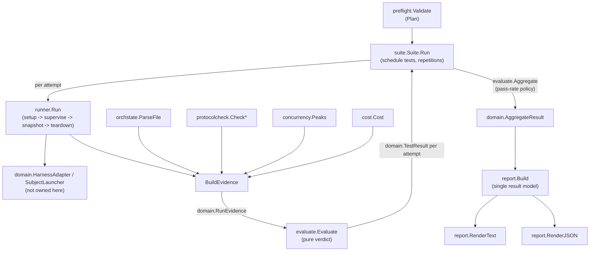

# Execution & Evaluation Flow

> Responsibility: Turn a validated, runnable test plan into a rendered report — one test attempt at a time, then aggregated across repetitions and across a whole suite.

## Overview

This is the area that actually runs a subject and decides whether it behaved correctly. It sits between two things it does not own: the authored/parsed test plan arriving from `Authoring`/`Fixtures` (via `preflight`), and the harness-specific machinery that spawns and observes a subject process (`domain.HarnessAdapter`, `domain.SubjectLauncher`, the Interception Pipeline). Everything in this area is either a *use case* orchestrating those collaborators (`suite`, `runner`) or a *pure evidence/verdict transform* consuming what they produced (`evaluate`, `concurrency`, `protocolcheck`) or an *adapter* fetching one evidence source (`orchstate`, `cost`) — plus the single rendering model both frontends traverse (`report`).

The area's job, end to end:

1. **Preflight** composes authored files into a cross-validated, runnable `Plan`.
2. **Suite** schedules the plan's tests in declared order, drives each test's declared repetitions, and applies the state-integrity retry-and-exclude rule.
3. **Runner** owns one attempt's full lifecycle: sandbox setup, supervised subject execution, an evidence snapshot taken before anything is torn down, and teardown that always runs.
4. Four independent evidence sources — **orchstate** (parses the subject's orchestration document), **protocolcheck** (validates Communication Protocol messages), **concurrency** (reconstructs true peak concurrency from the invocation log) and **cost** (delegates to an external log-analysis tool) — are assembled by Runner into one `domain.RunEvidence` value.
5. **Evaluate** is a pure function from evidence to verdict: per-assertion results, run conditions, and pass/fail/timeout, with a negative-test inversion rule and a retry predicate the caller (`suite`) consults.
6. **Suite** aggregates a test's repetitions against its declared pass rate, and **Report** builds the single result model — with its own derived outcome-classification rule — that both the text and JSON renderings, and both frontends, traverse.

## Components / Subdomains

| Component | Purpose |
|-----------|---------|
| **Preflight** | Composes `authoring`'s parsed suite/test-definition/stub-registry with `fixtures`' `$ref` resolution into one aggregated, deterministically ordered validation report plus a `Plan` — usable only when the report has no errors. Performs no process spawning, no sandbox creation. Does not itself own file-format parsing (`authoring`) or `$ref` resolution (`fixtures`); it only cross-checks and merges what those packages produce, and applies CLI-flag overrides and suite/definition setting layering. |
| **Runner** | Owns one attempt of one test end to end. Composes a workspace manager, a harness adapter, a subject launcher, a fixture resolver, a side-effect applier and a cost provider — every one a port or pure package, so this package spawns nothing directly and names no concrete harness. |
| **Suite** | Owns suite-level orchestration: deterministic test ordering, per-test repetition, delegating per-repetition evaluation and pass-rate aggregation to Evaluate, and the state-integrity retry-and-exclude rule. Sole producer of the progress-event stream (`domain.ProgressSink`). |
| **Evaluate** | Pure verdict engine. Turns one run's evidence into per-assertion results and a verdict; aggregates a test's repetitions against a declared pass rate; decides whether a result is a tool fault worth retrying. |
| **Orchstate** | Parses a MOSAIC orchestration document (frontmatter `current_state` plus the `[[SECTION:ExecutionLog]]` table) into the phase/status/execution-log evidence Evaluate consumes. Reuses `mosaic-common/docformat` and `mosaic-common/mdtable` rather than hand-rolling markdown parsing. |
| **Protocolcheck** | Pure Communication Protocol validator. Checks one message (a task invocation or an agent response) against a targeted protocol version and classifies every defect found. Used both for collaborator messages recorded by the Interception Pipeline and for the subject's own final message. |
| **Concurrency** | Pure reconstruction of peak simultaneous-invocation counts per declared parallel group, replaying the invocation log's start/end records as half-open time intervals rather than trusting any counter maintained live during interception. |
| **Cost** | Implements `domain.CostProvider` by shelling out to an external log-analysis tool's stable per-run-total contract and mapping its exit codes / wire shape to a `domain.CostReport`. No log parsing exists in this module. |
| **Report** | Defines `report.Result`, the single model every rendering and every frontend traverses, plus the two renderings (`RenderText`, `RenderJSON`) built from it and the one place `OutcomeClass` (pass / assertion_failure / timeout / state_integrity / cost_unattributed / echo_mismatch) is derived. |

## Key Flows

### One test attempt (`runner.Run`)

Four phases, with teardown guaranteed on every exit path — including a panic during execution and a setup that failed partway:

1. **Setup** creates a fresh sandbox, seeds declared files (resolving `$ref` through the fixture resolver, expanding a `{run_id}` placeholder in the declared path), writes the active stub registry and parallel-group document into the sandbox's control directory, initializes lock-guarded run state with the declared early-exit threshold and turn limit, and drives the harness adapter's own provisioning. Every step appends to a `SetupLedger` *before* what it created is used, so a failure between two steps still leaves the ledger describing exactly what exists — which is what makes teardown a precise removal rather than a guess.
2. **Supervised execution** hands the adapter's `SpawnPlan` to the launcher on its own goroutine (a panic there is recovered into an error, never left to crash the runner) and races three termination conditions: an early-exit sentinel file appearing (polled, not watched — file-change notification semantics differ across platforms and a missed notification would hang the run), the declared timeout elapsing, and the harness's own decoded result. The supervisor's own sentinel/timeout determination always wins over whatever the launcher's decoded result independently reports, because a context cancellation caused by the sentinel would otherwise decode as an ordinary timeout.
3. **Snapshot** captures everything the verdict engine will need — the subject-dir file listing, the invocation log records, the orchestration document state (or the reason it couldn't be read) — while the sandbox still exists, before teardown removes anything.
4. **Teardown** always runs (even after a panic, even after a setup fault): it drives the adapter's own deprovisioning first, then removes exactly the sandbox the ledger records, and surfaces either failure without letting one prevent the other. Cost is queried using the snapshot's captured log root *after* teardown, since cost attribution reads a log store outside the sandbox.

Runner then assembles `domain.RunEvidence` (`BuildEvidence`) from the snapshot plus derived measurements: it checks every recorded collaborator response — correlated to the invocation it answers by sequence number, since Runner is the only component holding both sides of a message pair — against the Communication Protocol, separately checks the subject's own final message (deriving its response context from the subject's declared opening message when that itself parses as a protocol invocation), and reconstructs peak concurrency from the same records.

### One test's repetitions and the state-integrity retry rule (`suite.runTest` / `runRepetition`)

A test runs its declared repetition count in strict order — never overlapped — because a repetition exists to sample a non-deterministic subject, and overlapping samples would make load itself part of what's being measured. Each repetition attempts up to `StateIntegrityRetries + 1` (currently 2) raw runs: if a run's evidence shows its state lock was reclaimed (a crash-recovery signal from the Interception Pipeline, not a fact about the subject), it is retried once; a second occurrence in the same repetition ends that repetition and is surfaced by `evaluate.Aggregate` as an infrastructure failure rather than a subject regression. Every raw attempt (including a retried one) still reaches `evaluate.Aggregate`'s excluded/counted split — only `evaluate.NeedsRetry` decides which raw attempts are excluded from the pass-rate denominator; nothing is recomputed by Suite itself.

### Evidence to verdict (`evaluate.Evaluate`)

A pure function: the same `domain.RunEvidence` always yields the same `domain.TestResult`, so a captured run can be re-evaluated after fixing an assertion without re-spawning an agent. It evaluates every assertion class the test definition declares (invocation sequence, execution-log agent IDs / uniform status, final phase/status, protocol-violation count, artifact created/not-created, minimum concurrency, task-message assertions) plus echo fidelity — evaluated for every stubbed invocation regardless of what the definition declares, and never inverted by a negative test, because a negative test cannot "expect" the tool's own echo mechanism to be broken. A negative test's other assertions are inverted after evaluation, not evaluated against an inverted expectation. The verdict is `Pass` unless: any non-echo assertion failed (→ `Fail`, reason `assertion`), echo fidelity failed (→ reason `echo_mismatch`, verdict still driven by the same fail path), the run's state lock was reclaimed (→ reason `state_integrity`), or the subject timed out (→ verdict `Timeout`, which takes precedence over every other reason). Separately, `evaluateConditions` surfaces exceptional facts that are not themselves verdict-affecting — unattributed cost, an unterminated concurrency interval, a degraded protocol-message extraction, an unmatched invocation, an unreadable orchestration document — so none of these are silently absorbed into a clean-looking pass.

### Suite run to rendered report

`suite.Run` schedules every test in the plan's declared order (never map iteration), building one `report.TestReport` per test from that test's aggregate plus its per-repetition `report.RunReport`s, and emits a matched pair of `ProgressSuiteStarted`/`ProgressSuiteFinished` events around the whole run plus `ProgressTestStarted`/`ProgressInvocation`/`ProgressTestFinished` events around each repetition. `report.Build` is the single place that derives suite-wide verdict counts and total cost from each test's aggregate — no other consumer of `report.Result` computes its own count or total. `report.Classify`/`report.OutcomeClass` is likewise the single place a run's visible outcome (possibly several classes at once — a timed-out run whose cost was also unattributed is two facts, not a precedence question) is derived, consumed identically by the text rendering, the JSON rendering and the interactive frontend's detail view.

A cancelled `context.Context` propagates into every in-flight attempt (so the guaranteed-teardown lifecycle still runs), and a cancelled suite returns whatever results it completed rather than discarding them — cancellation is not itself a suite failure.

## Relationships

| Talks To | For |
|----------|-----|
| Authoring & Fixtures (higher tier, not owned here) | Preflight consumes their parsed/resolved output to build a `Plan`; it performs no schema parsing or `$ref` resolution itself. |
| Interception Pipeline (invocation log, run state) | Runner reads the invocation log and locked run state as evidence; Suite/Evaluate read the "lock reclaimed" run event as the state-integrity signal. |
| Harness Adapters (`domain.HarnessAdapter`) | Runner drives `Provision`/`SpawnPlan`/`Deprovision` through the port only; no concrete adapter is imported here. |
| Subject Launch (`domain.SubjectLauncher`) | Runner hands a `SpawnPlan` to the launcher and supervises its result; process control itself is not owned here. |
| An external log-analysis tool (out of module) | Cost delegates entirely to it via subprocess invocation; no log parsing exists in this area. |
| Frontends (CLI, TUI) | Consume `report.Result` (never compute their own counts/totals) and the progress-event stream Suite produces; drive Suite/Preflight through the `SuiteRunner`/`PreflightFunc` abstractions. |

## Key Concepts

| Concept | Meaning |
|---------|---------|
| **SetupLedger** | An append-as-you-go record of exactly what one attempt's setup created (sandbox root, provisioning result, seeded files, control files). Teardown removes precisely the ledger's contents — nothing more, nothing inferred. |
| **State-integrity retry-and-exclude rule** | A run whose lock was reclaimed measures the tool's own crash-recovery, not the subject; it is retried once and excluded from the pass-rate denominator, and a second occurrence in the same repetition is reported as an infrastructure failure. |
| **Half-open interval reconstruction** | Concurrency's peak calculation treats each completed invocation as `[start, end)`; two invocations that merely abut (one starts exactly when the other ends) never count as concurrent. |
| **Unevaluated violation classes** | `protocolcheck.Result.Unevaluated` names a violation class the check could not decide (typically because the originating invocation's context was unrecoverable) — distinct from "checked and clean," so a rule that can't fire is never silently read as a pass. |
| **Outcome class vs. verdict** | A `domain.Verdict` (Pass/Fail/Timeout) is one value; `report.OutcomeClass` is a set — a run can exhibit several simultaneously, and this is the one place that set is derived for every consumer. |
| **`AsyncSink` / `MultiSink` / `DiscardSink`** | Suite's progress delivery is decoupled from the run itself: `AsyncSink` hands delivery to its own goroutine and, under saturation, drops only `ProgressInvocation` events (a display detail a UI can survive losing) while never dropping lifecycle events like test-finished (which would lose a verdict). A slow, blocking or panicking sink can neither stall nor fail a suite. |

## Boundaries

- **Owns:** the full lifecycle of one attempt (setup/supervise/snapshot/teardown), suite-level scheduling/repetition/retry, pure verdict evaluation, assembly of the four evidence sources into one evidence value, and the single report model plus its two renderings.
- **Does Not Own:** authored-file schema parsing or `$ref` resolution (owned by `authoring`/`fixtures`; Preflight only composes and cross-validates their output); anything harness-specific (owned by Harness Adapters); actual process spawning/decoding (owned by Subject Launch); the invocation-log/run-state storage format itself (owned by the Interception Pipeline; this area only reads it as evidence); concurrent execution of multiple tests within one suite — `suite.Options.MaxConcurrentTests` is declared but the current scheduler always runs a suite's tests strictly in sequence.

## Invariants & Conventions

- Teardown always runs for an attempt that began setup, on every exit path (normal completion, launch error, or a recovered panic) — a test tool that damages the sandbox it is measuring defeats its own purpose.
- A snapshot is taken before teardown removes anything; nothing the verdict engine needs is read after the sandbox is gone.
- Every pure-core package in this area (`evaluate`, `protocolcheck`, `concurrency`) performs no I/O and takes no ambient clock reads — the same input always yields the same output, which is what makes re-evaluating stored evidence without re-spawning an agent meaningful.
- `evaluate.Aggregate` and `report.Build` are the sole places a pass rate, a verdict count or a cost total is computed; nothing downstream (a rendering, a frontend) recomputes one independently.
- A negative test inverts every assertion's outcome except echo fidelity, and inverts only *after* evaluation — never by evaluating against a pre-inverted expectation.
- A repetition's raw attempts always run strictly in order, never concurrently, regardless of suite-level concurrency settings.
- `report.Result`'s wire (JSON) shape is additive-only: a field already emitted is never removed or retyped, and every collection renders as an empty array rather than `null`.

## Known Complexity

- **Per-attempt supervision race (`runner.superviseExecution`)** — three termination conditions (sentinel file, declared timeout, harness-reported completion) racing across goroutines, with a documented ordering rule for which signal is trusted when more than one could explain the same observed cancellation. This is dense enough, and consequential enough (a wrong call here misclassifies a test's outcome), to warrant its own deeper-tier document; recommended in KBProgress.md.
