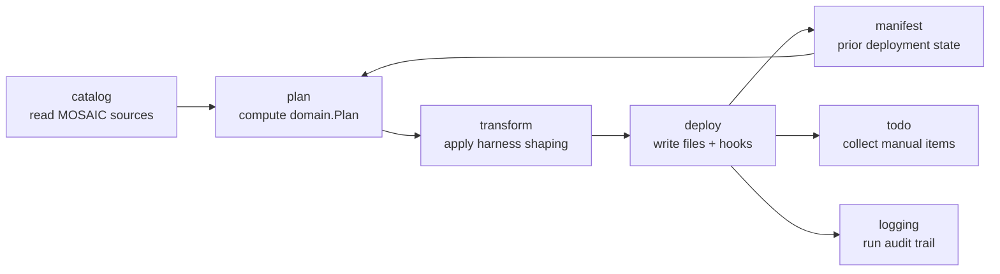

# Deployment Pipeline

> Responsibility: Turn a selection of MOSAIC sources (agents, skills, hooks, workflows) into a concrete, harness-specific set of files on disk, tracking what was written so future runs can detect drift — without ever touching MOSAIC source files.

## Overview

The Deployment Pipeline is the data-flow backbone of `mosaic-deploy`: a strict five-stage
pipeline that turns "what MOSAIC has" plus "what the user selected" into "what is now on
disk in the target workspace." Each stage has a single, non-overlapping responsibility, and
the stages compose in one fixed direction — no stage reaches backward into an earlier one.

Two of the five stages are pure functions with zero I/O (`plan.Build`, `transform.Apply`);
this is an enforced architectural boundary (see Tier 1 `Known Invariants` and
`internal/tools/importcheck`), not just a convention. All filesystem writing is concentrated
in one package (`deploy`), which is also the only package the `app` use-case layer calls
to make anything happen on disk.

## Components / Subdomains

| Component | Purpose |
|-----------|---------|
| **catalog** | Reads the MOSAIC repository tree exactly once per run and exposes agents, skills, hook bundles, workflows, and tiers as typed, immutable values. The only package that opens MOSAIC source files for reading. |
| **docformat** | The single authority on the MOSAIC document format (YAML-like frontmatter + markdown body with `<Name type="core">` / `<Name type="project">` boundary tags). Parses and serialises with byte-exact fidelity — untouched regions of a document round-trip unchanged. Used by both `catalog` (to extract workflow sections) and `transform` (to mutate frontmatter and injection regions). |
| **plan** | Computes a complete `domain.Plan` — what would happen to every selected artifact — by resolving the artifact set, deriving each target path via the harness module, and classifying each item against the manifest snapshot and current on-disk hashes. Performs no I/O; the caller supplies all catalog/manifest reads and on-disk hash lookups as plain data. |
| **transform** | A pure function (`Apply`): given one generic source file's bytes plus a harness module and request context, produces the harness-shaped output bytes and an audit `Report`. Drives all frontmatter field shaping and injection-region content through the harness module — no harness-specific logic lives in this package. |
| **deploy** | Executes a `domain.Plan` against the real filesystem: resolves the deployment root once, writes/creates/updates/skips each item per its classified action, manages conflict resolution and backups, deploys and registers hooks, and persists the manifest and TODO file. The only package in the module that performs content writes. |
| **manifest** | Reads and writes `<workspace>/.mosaic/manifest.yaml` — the record of what this tool has deployed. Distinguishes five load states (present / absent / empty / corrupt / future-schema) so callers never conflate "no manifest" with "manifest we can't trust." Also owns the canonical content-hash function used for local-modification detection. |
| **config** (supporting) | Loads/saves `tool-config.yaml` (project-scoped: utility-agent allow-list, external-module opt-in, log retention) and `user-config.yaml` (user-scoped: tier-to-model mappings). Absent files yield documented defaults, never errors. |
| **todo** (supporting) | Collects every gap produced across the pipeline (plan, transform, deploy) into one ordered set of categories and renders it two ways — `MOSAIC-DEPLOYMENT-TODO.md` and the on-screen run summary — from the same underlying data so the two views cannot disagree. |
| **logging** (supporting) | Writes a structured run record to two sinks (`latest.log` truncated per run, `history.log` appended). Write failures degrade rather than abort — logging can never be the reason a deployment fails. |

## Key Flows

### Plan Computation (catalog → plan)

1. The caller (app layer) loads the `catalog.Catalog` and a `manifest.Snapshot` for the
   target workspace, then probes every planned target path on disk to produce a
   `map[string]domain.DeployedArtifactState` (`plan.Input.DeployedState`). The state carries
   presence, a content hash, and the version stamps read directly from the deployed file's
   frontmatter. `plan.Build` itself never touches the filesystem.
2. `ResolveArtifacts` derives the full artifact set from the user's selections: the
   orchestrator is always included; agents are pulled in transitively from every selected
   workflow plus explicitly selected utility agents; skills are pulled in transitively from
   every included agent's `RequiredSkills`; hook bundles come from the explicit hook
   selection. Everything is deduplicated and sorted by key for determinism.
3. For each artifact, `Build` asks the harness module (via `domain.HarnessModule.TargetPath`)
   where it would land in the target workspace, then classifies the item into one of four
   actions using `DeployedState` as the sole source of truth for version comparison and
   presence. The manifest contributes only recorded content hashes (for local-modification
   detection) and state signals (absent/corrupt):
   - **Create** — no file at the current target path (`DeployedState[path].Present == false`),
     evaluated before consulting the manifest so an entry recorded by a different harness does
     not produce a spurious update.
   - **Conflict** — a file exists on disk whose content hash disagrees with the manifest's
     recorded hash (or a file exists with no manifest record for this target path, or the
     manifest itself is unusable). This is a conservative bias: "found on disk but can't
     confirm we wrote it" is always treated as a conflict, never silently overwritten.
   - **Update** — hash matches the manifest record, but one or more version fields (`version`,
     `mosaic_transform_version`, `mosaic_injections_version`, compared independently) differ
     between the deployed file and the current source/harness values, or the deployed file
     carries no readable version stamps at all. Legacy unprefixed names are accepted as
     fallback at every read site; a file carrying only legacy names is not spuriously stale and
     is migrated to the prefixed form on the next update. See Staleness Model below.
   - **Unchanged** — hash matches and all version fields agree with source.
4. Gaps are also surfaced during planning, before any transform runs: an agent with no
   resolved model produces `GapNoModel`; a generic tool the harness cannot map produces
   `GapUnmappedTool`; a hook registration step whose target file already exists in the
   workspace produces `GapHookRegistration`.
5. The returned `domain.Plan` is fully renderable — both frontends show it to the user for
   review before anything is written (`--dry-run` on the CLI stops here).

### Staleness Model

Staleness is evaluated per-field, never as a single "is this stale" boolean:

- **Agents** compare three independent fields — `version` (the source file's own version),
  `mosaic_transform_version`, and `mosaic_injections_version` (both sourced from the harness
  descriptor, so a harness update alone can mark every agent stale even if no source file
  changed). The deployed field names carry the `mosaic_` prefix; each read site accepts the
  legacy unprefixed names (`transform_version`, `injections_version`) as fallback so that
  files produced before the prefix migration are not spuriously stale. The prefixed name wins
  when both forms are present. The complete pairing of deployed names to legacy aliases is
  defined in `Tools/Deployment/internal/agentfields` — no read or write site scatters literal
  prefixed strings; all derive from that registry.
- **Skills** and **hook bundles** compare a single `version` field each.

Each mismatching field produces a `VersionDelta` (field name, deployed value, source value);
the plan item's `Reason` is a human-readable join of all deltas. This granularity lets the
TODO/summary views and the log explain *why* something is stale, not just *that* it is.

### Transformation (transform, applied per plan item during execution)

`transform.Apply` is invoked once per Create/Update/conflict-overwrite plan item, always as
a pure function: source bytes + harness module + request context in, output bytes + audit
`Report` out.

1. **Frontmatter shaping** — the harness module's `Frontmatter` method returns a plan of
   field removals, field sets, and key order; `Apply` executes it in a fixed order (remove →
   add/overwrite → model field → version stamps → tool fields → reorder) so that a field
   dropped and re-added under the same key by different steps resolves predictably. Every
   field mutation is recorded as a `FieldChange` (key, before, after, reason) for the audit
   trail.
2. **Tool resolution** — generic tool names (or a scalar placeholder like
   `{tool-permissions}`) are resolved to harness-specific tool fields entirely through
   `Module.Tools`/descriptor `PlaceholderExpansion`; unmapped or skipped tools produce
   `GapUnmappedTool` rather than silently disappearing.
3. **Injection region handling** — each `<Name type="project">` region in the body is resolved
   according to its class:
   - **Harness-class** injections are always refreshed from the module on every transform
     (never lifted from the previously-deployed file) — they represent harness-owned content.
   - **Project-class** injections are emptied (with a `GapEmptyInjection` gap) on a brand-new
     deployment, or lifted byte-identically from the previously-deployed file on an update.
     An injection point newly added in the source (absent from the deployed file) starts
     empty rather than erroring.
   - **Workflow-class** (`AvailableWorkflows`) is fully reassembled every time from the
     currently-selected workflow blocks, in selection order — never merged with prior
     content, to prevent duplication.
   - An injection point present in the previously-deployed file but no longer present in the
     source is **orphaned**: its content is dropped from the output, but surfaced via a
     `GapRemovedInjection` gap (with the discarded content attached) so nothing is silently
     lost — the user can recover it from the pre-write backup if needed.
4. Body prose outside injection regions is never touched — this is what "byte-exact
   fidelity" means in practice: a re-run with no actual content change produces byte-
   identical output.

### Execution (deploy)

1. **Deployment root resolution (once, before any content write)** — the executor probes
   writability using the first Create/Update plan item. It tries, in order: the workspace
   itself, then `<MosaicRoot>/MosaicDeploy/fallback/<workspace-slug>/`, then
   `<os-temp>/mosaic-deploy/<workspace-slug>/`. Whichever tier succeeds becomes the
   deployment root for the *entire* run — the tier is never re-evaluated mid-run. If none of
   the three tiers are writable, the run fails outright.
   - When a fallback tier is used, every item is still physically written there (so the
     deployment is complete in one location), but each per-item action record is marked
     failed with respect to the workspace (the user's actual intended target), and a
     `GapFallbackLocation` gap is emitted so the user knows to move the files manually.
2. **Per-item execution** — for each plan item, in plan order:
   - `Unchanged` items are recorded as taken with no write and no manifest change.
   - `Create`/`Update` items call back into `transform.Apply` (via the injected `Content`
     function — the executor never imports `transform` directly, keeping it testable without
     a full transform pipeline) and write the result.
   - `Conflict` items require a caller-supplied decision per target path (`Skip` /
     `Overwrite` / `BackupThenOverwrite`); a missing decision for any conflict item is a
     programming error (`ErrUndecidedConflict`) — the app layer must resolve every conflict
     before calling `Execute`.
   - `BackupThenOverwrite` copies the current on-disk file to
     `<workspace>/.mosaic/backups/<relative-path>.<RFC3339-compact-with-nanoseconds>.bak`
     before writing the new content, so repeated backups of the same file in the same run
     never collide.
3. **Hook deployment and registration** — hook bundle files are copied to the harness's
   declared target directory. Registration steps (edits to files the tool doesn't own, e.g.
   `.claude/settings.json`) follow a fixed policy: not performable → always a manual-step
   gap; performable and target absent → write the fragment silently; performable and target
   present → never modify it, always emit a registration gap so the user pastes it in by
   hand. This "never touch a file that isn't ours to fully own" rule is deliberate — the tool
   does not attempt partial edits of user-owned config files.
4. **Manifest and TODO persistence** — the executor builds the final manifest from what
   actually landed on disk (not from what the plan predicted), so a partial failure mid-run
   still leaves a manifest that matches reality. The TODO file combines every gap collected
   across all three earlier stages (plan, transform, deploy) into one ordered checklist.
5. **Outcome classification** — `OutcomeFailed` only when an actual content write failed
   mid-plan (not merely a fallback); a complete fallback deployment or any skipped conflict
   produces `OutcomeCompletedWithGaps`; otherwise `OutcomeSuccess`.

### Manifest Lifecycle

The manifest is the pipeline's only persistent memory of prior runs. Its `Store.Load` never
collapses distinct failure modes into a generic empty result — absent, empty, corrupt, and
future-schema manifests are each a distinct `State`, and `plan.Build` treats every
non-present state identically (conservative: on-disk files are treated as possible
conflicts) rather than guessing. Content hashes use `sha256:<lowercase-hex>` with **no
normalisation** — a line-ending-only change between what's on disk and what the manifest
recorded is a real, detectable local modification, not noise to be smoothed over.

## Relationships

| Talks To | For |
|----------|-----|
| Harness System (`domain.HarnessModule` via registry) | `plan` calls `TargetPath`/`Tools`/`HookPlan` to resolve where things go and how they're shaped; `transform` calls `Frontmatter`/`Tools`/`Injection` to get harness-specific content. Neither package imports a specific harness — only the port interface. |
| Use-Case Layer (`app`) | Constructs `plan.Input`/`ExecRequest` from catalog + manifest + user selections, invokes `plan.Build` then (after review) `deploy.Executor.Execute`, and supplies the `Content` callback that bridges plan items to `transform.Apply`. |
| Frontends (via `app`) | Never call pipeline packages directly; all pipeline access is mediated by `app`. |

## Key Concepts

| Concept | Meaning |
|---------|---------|
| Plan item action | One of Create / Update / Unchanged / Conflict — the single classification a plan item carries into execution. |
| Version delta | An independent per-field staleness signal (`version`, `mosaic_transform_version`, `mosaic_injections_version` for agents; a single `version` for skills/hooks). Deployed field names carry the `mosaic_` prefix; legacy unprefixed names are accepted as fallback (prefixed wins when both present). |
| Injection class | Harness / Project / Workflow — determines whether region content is always refreshed, preserved-then-refreshed, or fully reassembled. |
| Gap | A structured "this needed a human decision or couldn't be automated" signal, produced at any of the plan/transform/deploy stages and funneled into `todo`. |
| Fallback tier | Workspace / MOSAIC-root / OS-temp — the three-tier writability chain resolved exactly once per run. |
| Deployment root | The single resolved directory (one of the fallback tiers) that every content write in a run targets. |

## Boundaries

- **Owns:** Reading MOSAIC sources; computing what a run would do; shaping generic content
  into harness-specific bytes; performing the actual writes, backups, hook registration, and
  manifest/TODO/log persistence for one run.
- **Does Not Own:** Deciding *which* harness, workspace, workflows, or agents to use (that's
  the Use-Case Layer, via user interaction); knowing *how* a specific harness maps tools or
  frontmatter fields (that's the Harness System, reached only through `domain.HarnessModule`);
  presenting plans or prompting the user (that's the frontends).

## Invariants & Conventions

- `plan.Build` and `transform.Apply` perform no I/O, no clock reads, no randomness — every
  input arrives as a field on a request struct, enforced at build time by the import-boundary
  guard (`tools/importcheck`), not just convention.
- The deployment root is resolved exactly once per run, before any content write; it is never
  re-probed mid-run even if a later write to that root would fail.
- A file found on disk that cannot be confirmed as tool-written (no manifest, or manifest
  unusable) is always classified as a conflict, never auto-created or auto-overwritten.
- Content hashes are never normalised — byte-for-byte comparison only.
- Harness-class injection content is always regenerated from the module; project-class
  content is only ever lifted from what was actually deployed before, never invented.
- Registration steps never modify a workspace file that already exists; they either write to
  an absent target or defer to a manual TODO item.
- The manifest written after execution reflects actual on-disk state, including through a
  partial failure — it is never derived purely from the pre-execution plan.
- Every gap raised anywhere in the pipeline (plan, transform, deploy) flows into exactly one
  `todo.Collector`, so the TODO file and on-screen summary are always in agreement.

## Known Complexity

No further tier is recommended for this scope at this time. The five-stage flow, the
staleness model, and the injection merge policy are the load-bearing complexity here, and
they are captured above at a level a KB consumer can act on without re-deriving them from the
classification/execution code. If the docformat parsing/serialisation model (byte-exact
frontmatter and boundary-tag handling) proves to need independent reference documentation for
consumers working directly on document mutation logic, that would be the next candidate for a
deeper tier — it was not split out here because no flow in this pipeline requires understanding
its internal parsing algorithm, only its documented guarantees (byte-exact round-trip,
section/injection boundary recognition).
