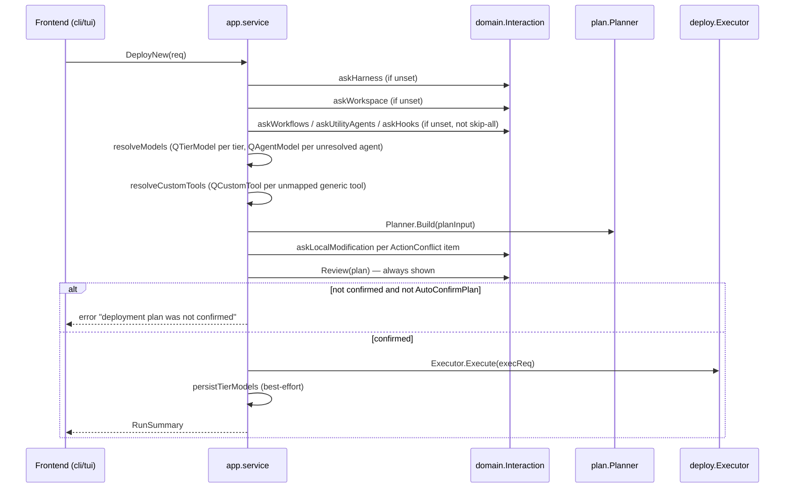

# Use-Case & Frontend Layer

> Responsibility: Sequencing the two top-level flows (deploy-new, update), consulting the user for any decision not pre-answered, and presenting that consultation through two interchangeable frontends (a non-interactive CLI and an interactive terminal UI).

## Overview

This area is the "outer ring" of the tool: it does not read MOSAIC sources, compute plans, or write files — it decides *when* to ask a question, *what* question to ask, and *how* that question reaches a human (or a pre-supplied answer). It sits directly on top of the Deployment Pipeline and Harness System, calling into them but never being called by them.

The layer has three parts:
- **app** (the use-case layer) — the single place flow sequencing lives. Both frontends call the same two methods (`DeployNew`, `Update`) and get the same `domain.RunSummary` shape back.
- **cli** — a non-interactive frontend that resolves every question from pre-supplied data (flags, a selections file) and never blocks on terminal input.
- **tui** — an interactive frontend built on Bubble Tea that owns the terminal, shows question-shaped prompts as overlays, and renders plan-review and run-summary screens.
- **cmd/mosaic-deploy** — the single entry point. It constructs every dependency exactly once, chooses which frontend to hand control to, then exits.

The two frontends never talk to each other and never depend on each other. Both depend only on `app.Service`; `app` depends on neither of them (enforced mechanically — see Invariants).

## Components / Subdomains

| Component | Purpose |
|-----------|---------|
| **app.Service** | Public contract: `ListHarnesses`, `DeployNew`, `Update`. Both frontends call exactly these. |
| **app flow sequencing** (deploy.go, update.go) | Encodes the documented deploy-new and update flows as an ordered sequence of resolver calls; each resolver either consumes a pre-answered request field or asks exactly one question through `domain.Interaction`. |
| **app resolvers** (resolve.go) | Shared building blocks used by both flows: harness/workspace/workflow/utility-agent/hook selection, tier and per-agent model resolution, custom-tool-name resolution, locally-modified-file prompting, content-generation wiring, update-flow workflow discovery. |
| **app summary assembly** (summary.go) | Derives a single `domain.RunSummary` (and its `Outcome`) from the executor's result and the accumulated TODO gaps, so CLI and TUI render identical information. |
| **domain.Interaction port** | The one channel through which app may consult a user. Two implementations exist: `cli.nonInteractive` and `tui.ProgramRef`. |
| **cli command dispatch** (run.go) | Cobra-based `deploy`/`update` subcommands; parses flags into `app.DeployRequest`/`app.UpdateRequest`. |
| **cli non-interactive Interaction** (interaction.go) | Resolves each question from a `PreAnswers` map (`QuestionID` → subject → answer string); anything not found is recorded as a gap and skipped rather than blocking. |
| **cli selections file** (commands.go) | Optional YAML file (`--selections`) supplying `workflows`/`utility_agents`/`hooks`/`tier_models` directly into the request, bypassing `PreAnswers` entirely for those fields. |
| **cli output rendering** (output.go) | Human-readable or `--output json` rendering of `domain.RunSummary`; maps `Outcome` to the process exit code. |
| **tui root model** (app.go) | Bubble Tea state machine: three entry screens (harness → mode → workspace), then a background call into `app.Service`, with question overlays appearing as the service asks. |
| **tui ProgramRef** (interaction.go) | The interactive `domain.Interaction` implementation. Each blocking method sends a `questionMsg` to the running `tea.Program` and blocks on a reply channel until the root model answers it. |
| **tui screens package** | Self-contained, headlessly-testable screen models: three entry screens (harness, mode, workspace) plus question-overlay screens (model select, text prompt, conflict, review, summary) and three richer selection screens (workflow browser, utility-agent list, hook picker) each wired to their dedicated `QuestionID` in the root model's `questionSelectMany` routing table (`QWorkflows` → `WorkflowBrowserScreen`, `QUtilityAgents` → `UtilityAgentScreen`, `QHooks` → `HookScreen`; unrecognised IDs fall back to the generic `inlineSelectOne`). |
| **cmd/mosaic-deploy** | Constructs catalog, registry, planner, executor, manifest store, config stores, logger, TODO collector once; decides CLI vs TUI; wires the frontend-appropriate `Interaction` implementation into `app.Deps`. |

## Key Flows

### DeployNew

Each resolver follows the same rule (CD-6): a pre-answered `DeployRequest` field is used as-is; an unset field asks through `Interaction` unless the caller pre-latched `SkipAll` for that `QuestionID`, in which case an empty/default is used without asking. This is the single mechanism that makes CLI flags and TUI screens interchangeable — the flow code has no notion of which frontend is driving it.

### Update

Same shape as DeployNew but scope is always `ScopeProject`, and workflow selection is replaced by **discovery**: `discoverExistingWorkflows` reads the deployed orchestrator file, extracts `<Workflow type="core" name="<id>">` section nodes to find what is already injected, and unions that with any `AddWorkflowIDs` the caller supplied — so an update never silently drops a previously-added workflow. Per-file conflict decisions use `req.ConflictDefault` when set (CLI's `--conflict` flag), otherwise ask via `askLocalModification` exactly like DeployNew. Update does not run model or custom-tool resolution — the update flow re-renders content using the harness module directly and does not re-prompt for models already baked into deployed files.

### CLI dispatch

`cmd.Run` parses args with cobra, builds a `DeployRequest`/`UpdateRequest` directly from flags (and optionally a `--selections` YAML file for workflows/utility-agents/hooks/tier-models), calls the service, and renders the result. When `--selections` is provided, `main.go` calls `buildPreAnswers` before constructing `cli.NewInteraction`: `buildPreAnswers` reads the YAML file via `cli.PreAnswersFromSelectionsFile` and produces a `PreAnswers` value encoding the workflow, utility-agent, hook, and tier-model selections as pre-resolved answers keyed by `QuestionID` and subject. `cli.NewInteraction` receives this populated map and resolves each matching question from it as `Answered`, leaving no gaps for those fields. Questions not covered by a `DeployRequest`/`UpdateRequest` field or by a `PreAnswers` entry (for example, per-agent model overrides or per-file conflict decisions absent from `--selections`/`--conflict`) are still resolved as `SkippedOne`/`SkippedAll` and recorded as TODO gaps. The `Review` step is not routed through `PreAnswers` — it is controlled by the `AutoConfirmPlan` request field (set via `--auto-confirm`); a run that reaches plan review without `--auto-confirm` will report the plan not confirmed.

### TUI interactive session

`tui.Run` owns the terminal for the process lifetime. Three entry screens (harness → mode → workspace) are answered as *local* UI state before the service call even starts — they are not asked through `Interaction`. Once the third screen is done, `startService` launches `app.Service.DeployNew`/`Update` in a goroutine seeded with only `HarnessID` and `WorkspacePath` (mode-specific fields like workflows/models are intentionally left unset so the service asks for them through `Interaction`, driving the overlay screens). Every subsequent blocking `Interaction` call from the service goroutine sends a `questionMsg` over the `tea.Program`; the root model swaps in the matching overlay screen, and the overlay's `Answer()` is sent back over a reply channel, unblocking the service goroutine. `ctrl+c` cancels the model's context and, if a question is in flight, immediately answers it as `Cancelled` so the service goroutine cannot hang.

## Relationships

| Talks To | For |
|----------|-----|
| **Harness System** (via `registry.Registry`) | Resolving a harness ID into a `domain.HarnessModule`; listing harnesses for the picker; resolving tool names and building hook plans. |
| **Deployment Pipeline — plan** | `plan.Planner.Build` to compute the `domain.Plan` shown at Review; `plan.ResolveArtifacts` to expand workflow/utility-agent/hook IDs into concrete agents/skills/hooks. |
| **Deployment Pipeline — transform** | `transform.Apply`, invoked from `buildContent`, to render one agent file per plan item. |
| **Deployment Pipeline — deploy** | `deploy.Executor.Execute` to perform the actual write/backup/manifest/hook-registration pass. |
| **Support Infrastructure — config** | `ToolConfigStore` (utility-agent allow-list) and `UserConfigStore` (persisted tier→model mappings, read at the start of `resolveModels` and written by `persistTierModels`). |
| **Support Infrastructure — manifest** | `Manifest.Load` to obtain the snapshot passed into `plan.Input` for staleness comparison. |
| **Support Infrastructure — todo/logging** | Every gap (`GapNoModel`, `GapUnmappedTool`, `GapSkippedFile`) is recorded through `deps.Todo`; log file paths and any degraded-logging errors are folded into `RunSummary`. |

## Key Concepts

| Concept | Meaning |
|---------|---------|
| **CD-6 (pre-answer vs. ask)** | The rule every resolver in `app` follows: use a pre-supplied request field if set; otherwise ask through `Interaction`, honoring per-`QuestionID` skip-all latching. This is what makes CLI and TUI interchangeable at the flow level. |
| **SkippedAll latching** | Once a question ID is answered `SkippedAll` (or pre-latched via `req.SkipAll`), every subsequent question with that same ID in the run is skipped without asking again — prevents a long run from re-prompting for the same kind of decision repeatedly (e.g. per-agent models). |
| **Four Interaction question shapes** | `ChoiceQuestion` (backs both `SelectOne` and `SelectMany`), `TextQuestion` (`AskText`), the bare `Question` (`Confirm`), and `Plan` (`Review`). Every question in the system fits one of these four; a question that does not fit is a port design defect, to be fixed in `domain`, not worked around in a frontend. |
| **RunSummary as the single source of truth** | Both frontends render the same `domain.RunSummary` value — CLI as text/JSON, TUI as the SummaryScreen — so the two frontends can never disagree about what happened in a run. |
| **CD-4 (frontend equivalence)** | Equivalent inputs (same pre-answers on CLI, same scripted selections on TUI) must produce equivalent `QuestionID` sequences and equivalent outcomes; verified directly by `tui/equivalence_test.go` using `cli.NewInteraction` and a scripted `interactiontest.Stub` side by side. |

## Boundaries

- **Owns:** Flow sequencing and ordering of decision points for DeployNew/Update; deciding whether to ask or use a pre-answer; assembling `RunSummary`; presenting questions to a human through two frontend-specific renderings; process argument parsing and exit codes (cli); terminal ownership and screen navigation (tui); one-time dependency construction and frontend selection (cmd/mosaic-deploy).
- **Does Not Own:** Computing what a plan contains (Deployment Pipeline's `plan` package), transforming file content (`transform`), writing files or the manifest (`deploy`), resolving tool names or harness capabilities (Harness System), or reading MOSAIC sources (`catalog`). `app` never imports `tui` or `cli`.

## Invariants & Conventions

- `internal/app` may not import `internal/tui` or `internal/cli` — mechanically enforced by `imports_test.go`, which parses every non-test `.go` file in `app` (and its `interactiontest` sub-package) and fails if either forbidden import path appears.
- `domain.Interaction` is the *only* channel through which `app` may consult a user; no frontend-specific type ever crosses into `app`.
- `Notify` and `Progress` never fail and never block, in either `Interaction` implementation.
- The CLI's non-interactive implementation must never block on terminal input under any circumstance — an unresolvable question always resolves immediately to `SkippedOne`/`SkippedAll` plus a recorded gap, never a stall.
- `Review` is always shown to the user in both flows, even when the caller intends to auto-confirm; `AutoConfirmPlan` only changes whether a non-confirming answer aborts the run, not whether the step happens — this guarantees the confirmation step is always the last recorded interaction before execution.
- The `tui/screens` package may import only `domain` and `tui/widgets` (plus third-party styling libraries) — never the parent `tui` package — so screens remain independently, headlessly testable.
- `cmd/mosaic-deploy` is the only place infrastructure (catalog, registry, planner, executor, manifest store, config stores, logger, TODO collector) is constructed; neither frontend package constructs its own dependencies.

## Known Complexity

- **TUI multi-select routing uses a `QuestionID` switch in `handleQuestionMsg`.** `questionSelectMany` messages are dispatched by `QuestionID`: `QWorkflows` → `WorkflowBrowserScreen`, `QUtilityAgents` → `UtilityAgentScreen`, `QHooks` → `HookScreen`. Any `SelectMany` question with an unrecognised `QuestionID` falls through to the generic `inlineSelectOne` overlay. This routing table in `app.go` is the single place where a new `SelectMany` question ID must be registered if a richer screen is added for it.
- **CLI's `PreAnswers` map is the canonical pre-answer source for the non-interactive `Interaction`.** `main.go` calls `buildPreAnswers` before constructing `cli.NewInteraction`; when `--selections` is supplied, `buildPreAnswers` reads the YAML file via `cli.PreAnswersFromSelectionsFile` and populates a `PreAnswers` value encoding workflow, utility-agent, hook, and tier-model selections. The `Interaction` resolves any question whose `QuestionID` and subject match a `PreAnswers` entry as `Answered`; anything not found is skipped and recorded as a TODO gap. The plan-review step (`Review`) is not routed through `PreAnswers` — it is controlled by `AutoConfirmPlan` in the request (set via `--auto-confirm`), so a run that reaches plan review without `--auto-confirm` will still report the plan not confirmed.
