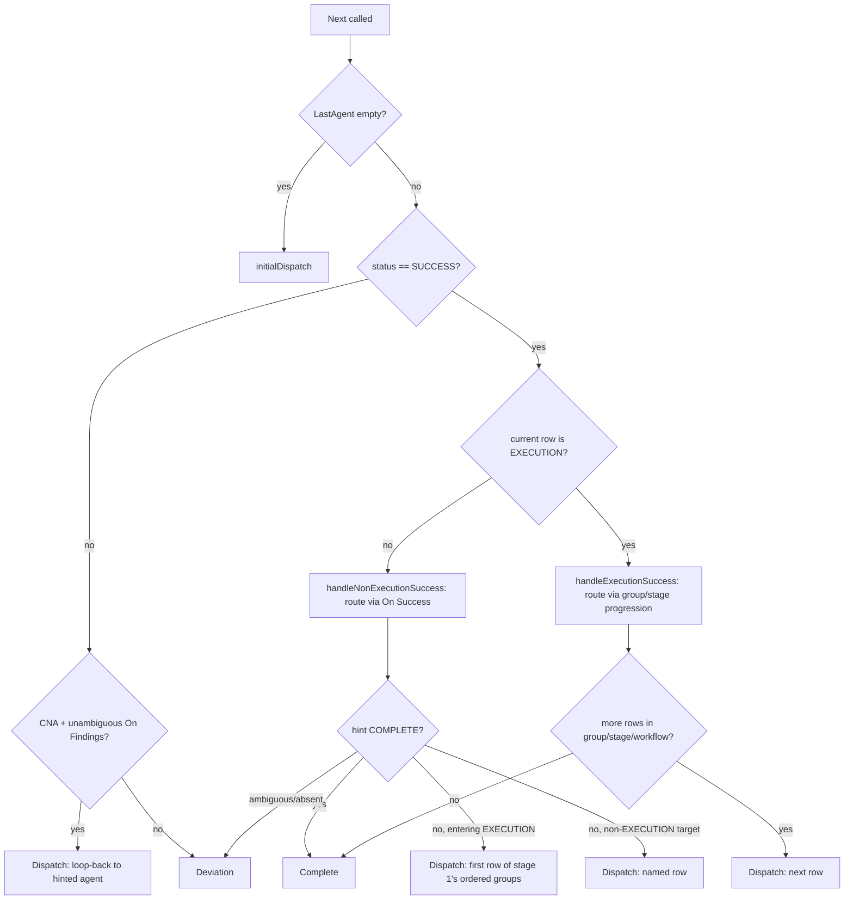

# engine

> Responsibility: The pure, side-effect-free decision core that answers "what happens next" for a run — given the admitted workflow, the stage set, and the current artifact state, it decides whether to dispatch an agent, mark the run complete, escalate a deviation, or stop.

## Overview

`engine` is the state machine at the heart of the runner. Every other package either feeds it inputs (workflow, stages, artifact state) or acts on its outputs (session, via dispatch/harness/artifact). It contains no I/O and no non-deterministic behavior — the same inputs always produce the same `EngineDecision`, which is what makes golden-file testing of full runs possible.

The package exposes two pure functions:
- **`Next`** — the main per-invocation router: given the state after the most recent agent response (or no prior response at all), decide the next step.
- **`ResumePoint`** — a separate, purely artifact-derived function used only when a run is resumed after a process restart: it reconstructs where execution left off, independent of `Next`'s response-driven routing.

Both functions operate entirely on the routing table shape produced by **compat** (`AdmittedWorkflow`, with its resolved pre-execution/execution/post-execution row ranges and one or two ordered execution `Groups`) and the stage list produced by **planstages** (`StageSet`, one entry per stage carrying its `Approach` and per-stage HITL flag).

## Components / Subdomains

| Component | Purpose |
|-----------|---------|
| **Next / routing dispatch** | Classifies the current situation (first call, non-SUCCESS response, non-EXECUTION SUCCESS, EXECUTION SUCCESS) and delegates to the matching handler. |
| **Row location (`findCurrentRowIndex`, `findRowForLogEntry`, `findExecutionRowBySeq`)** | Maps an artifact's recorded agent/phase/stage/sequence back to a concrete routing-table row index — the inverse of dispatch. Needed because the same agent identifier can appear in multiple EXECUTION rows (e.g. a review agent used in both the test group and the implementation group). |
| **Approach/group ordering (`orderedGroupsForApproach`, `computeNextFromExecution`)** | Encodes how the two EXECUTION groups (test, implementation) are sequenced per stage based on that stage's `Approach` value, and how execution advances across groups and stages. |
| **Dispatch step construction (`buildDispatchStep`, `resolveArtifacts`)** | Builds the concrete `DispatchStep` (protocol request, effective HITL, resolved artifact paths) for a target row, expanding `{StageNumber}` and `Stage-*` template variables in artifact paths. |
| **ResumePoint** | Reconstructs a `ResumeInfo` purely from `ArtifactState` (no `lastResponse`), used at process-restart resume time before the dispatch loop's first `Next` call. |

## Key Flows

### Next — the per-invocation state machine

`Next` is called once per iteration of session's dispatch loop, after an agent has (or has not yet) responded. Its routing branches, in order:

1. **First call ever** (`state.CurrentState.LastAgent == ""`): calls `initialDispatch`, which picks the very first row to run — the first pre-execution row if any exist, otherwise the first row of a non-staged workflow, otherwise the first row of stage 1's first execution group (ordered per that stage's approach).
2. **Non-SUCCESS response**, two sub-cases:
   - `COMPLETED_NEEDS_ACTION` **with an unambiguous `On Findings` hint** (a plain agent identifier or `COMPLETE`, no spaces/parentheses): treated as a deliberate loop-back — dispatches directly to the named agent's row rather than escalating.
   - **Everything else non-SUCCESS** (including ambiguous/absent `On Findings`): returns a `Deviation` decision carrying the full response and current position, for session/deviation to resolve.
3. **SUCCESS on a non-EXECUTION row**: routes via the row's `On Success` hint (`handleNonExecutionSuccess`). An unambiguous hint of `COMPLETE` ends the run; an unambiguous hint naming an agent that lives inside an EXECUTION row is treated as "entering the EXECUTION phase" — the actual first row dispatched is determined by stage 1's approach-driven group ordering, not literally the named agent's row (the named agent in the routing table reflects the default TDD ordering only). An unambiguous hint naming a non-EXECUTION agent dispatches that row directly. An ambiguous/absent hint returns a `Deviation` (`DeviationAmbiguousRoute`).
4. **SUCCESS on an EXECUTION row**: routes via `handleExecutionSuccess`/`computeNextFromExecution`, ignoring `On Success` entirely (`On Success` is intentionally not consulted inside EXECUTION — see Boundaries below).

### EXECUTION group/stage progression (`computeNextFromExecution`)

This is the core state-machine logic for the staged EXECUTION phase, used by both `handleExecutionSuccess` (in `Next`) and indirectly mirrored by `ResumePoint`'s resume-after-restart logic:

1. Determine the current stage's `Approach` (TDD, implementation-first, implementation-only, or tests-only) and derive the ordered group list for it (`orderedGroupsForApproach`). For single-group workflows, approach has no effect.
2. If the current row is not the last row of its group, advance to the next row within the same group.
3. If it is the last row of its group but another group remains in the same stage, jump to the start of the next group.
4. If it is the last row of the last group in the stage, look up the next stage number in the `StageSet` and, if found, jump to the first row of that stage's first ordered group (each stage's approach can differ, so group ordering is re-derived per stage).
5. If no next stage exists, dispatch the first post-execution row if the workflow has one; otherwise the run is `Complete`.

### Row identification by sequence (`findExecutionRowBySeq`)

Because the same agent can appear in more than one EXECUTION row (e.g. a review agent shared by both groups), `Next` cannot always identify "which row just ran" by agent name and phase alone. When an agent has multiple EXECUTION-row matches, the engine falls back to reconstructing the row from the artifact's `global_sequence` number: it sums the number of active rows contributed by every stage before the current one (each stage's row count depends on its own approach), then walks the current stage's ordered groups to find the row at the resulting 1-indexed position. This assumes contiguous sequence numbering with no gaps from prior deviations within the same stage.

### ResumePoint — reconstructing position after a restart

`ResumePoint` is independent of `Next` and is called once, at session run-start, before the dispatch loop begins:

- **No execution log entries**: fresh start, resume from row 0.
- **Log's last entry matches `CurrentState.LastAgent`**: clean completion, resume from the row after the last completed one (using the same non-EXECUTION vs. EXECUTION group/stage advancement logic as `computeNextFromExecution`, but restricted to a single-step lookahead rather than full deviation-aware routing).
- **Log's last entry does NOT match `CurrentState.LastAgent`**: interruption detected — the last dispatch was recorded in the execution log but never confirmed in `CurrentState`, meaning the process died mid-invocation. `ResumeInfo.RerunLast` is set to `true` and the same row is re-dispatched (this is the FR-33 requirement referenced in the source).

### Dispatch step construction

Whenever a row is selected for dispatch (by any of the flows above), `buildDispatchStep` assembles the `DispatchStep`:
- **Effective HITL** = row-level HITL OR (if inside an EXECUTION row) that stage's HITL flag from the `StageSet` entry.
- **Artifact path resolution** (`resolveArtifacts`): `{StageNumber}` is substituted with the numeric stage value (only valid when inside a staged EXECUTION row — otherwise an unresolvable-template error surfaces as a `Stop`). `Stage-*` in **input** artifacts expands into one path per stage entry in the effective stage set (using `refreshedStages` instead of the run-start `stages` when available and the row is non-EXECUTION — this lets re-derived stage lists feed a re-planning step). `Stage-*` in **output** artifacts is passed through unexpanded (the agent itself decides which stage's file to write).
- **Agent instance ID** is `{agentIdentifier}#{seq+1}` — `seq` is incremented before use, so instance numbering is 1-based per agent across the run.

## Relationships

| Talks To | For |
|----------|-----|
| **domain** | Sole internal import — all types (`AdmittedWorkflow`, `StageSet`, `ArtifactState`, `ProtocolResponse`, `EngineDecision` and its variants, `ResumeInfo`) come from here. `engine` imports nothing else internal. |
| **session** | The exclusive consumer. Session calls `ResumePoint` once at run-start, then calls `Next` in a loop, translating each `EngineDecision` into I/O: dispatching via `harness`, writing via `artifact`, or invoking `deviation`. |
| **compat** (indirect, via inputs) | Supplies the `AdmittedWorkflow` shape (pre-execution/execution/post-execution row ranges, `Groups`, `TwoGroup`, `HasStagedPhase`) that all of the group/stage logic depends on. |
| **planstages** (indirect, via inputs) | Supplies the `StageSet` (`Approach` and HITL per stage) that drives approach-based group ordering and effective HITL computation. |

## Key Concepts

| Concept | Meaning |
|---------|---------|
| **EngineDecision** | The tagged-union return type of `Next`: exactly one of `Dispatch`, `Complete`, `Deviation`, `Stop` is non-nil. |
| **Unambiguous hint** | An `On Success`/`On Findings` column value is "unambiguous" when the column is present, non-empty, and contains no spaces or parentheses — i.e. a bare agent identifier or the literal keyword `COMPLETE`. Anything else (free-form text, absent column) cannot be routed deterministically and produces a `Deviation`. |
| **On Success is ignored inside EXECUTION** | Routing between EXECUTION rows is governed entirely by group/stage/approach progression, never by the `On Success` column value — that column's agent reference in EXECUTION rows exists only to describe the default TDD ordering for humans reading the workflow table, not to drive the engine. |
| **Ordered groups per approach** | For two-group (test + implementation) workflows, `Approach` (TDD, implementation-first, implementation-only, tests-only) determines both which groups run and their order for a given stage; this is re-derived per stage since different stages may declare different approaches. |
| **Deviation kinds** | `DeviationNonSuccess` (any non-SUCCESS response without an unambiguous loop-back hint), `DeviationAmbiguousRoute` (a SUCCESS response whose `On Success` hint can't be resolved), `DeviationHarnessError` (declared in domain but not produced anywhere inside `engine` itself — it originates from session/harness before `Next` is even called). |
| **Interruption / RerunLast** | Detected by `ResumePoint` when the last execution-log entry's agent doesn't match `CurrentState.LastAgent` — signals the process died between logging a dispatch and recording its completed response; the interrupted row must be re-dispatched rather than advanced past. |

## Boundaries

- **Owns:** The routing decision logic itself — what row runs next, in what order, with what effective HITL, and with what resolved artifact paths; and resume-position reconstruction after a restart.
- **Does Not Own:** Parsing or validating the workflow/stage/artifact inputs (that's orchfile/workflow/compat/planstages/artifact); performing the actual dispatch, I/O, or clock reads (that's session and its adapters); resolving deviations once flagged (that's deviation); constructing `AgentReference` values (that's agentresolve — engine only looks them up by identifier in the map it's given).

## Invariants & Conventions

- No I/O, no filesystem/network/random access, no `time.Now()` calls anywhere in this package — the `time.Time` parameter to `Next`/`buildDispatchStep` is currently accepted but not inspected by any routing logic (reserved for future use).
- Exactly one field of `EngineDecision` is non-nil per call.
- `DispatchDecision.Steps` always contains exactly one element today (see project-level invariant); the slice shape exists to reserve room for future parallel dispatch.
- `On Success` is never consulted while routing within the EXECUTION phase; `On Findings` is only consulted for `COMPLETED_NEEDS_ACTION` responses, never for other non-SUCCESS statuses.
- Row and stage lookups always prefer a unique agent+phase match; sequence-based (`findExecutionRowBySeq`) matching is only used as a fallback when an agent appears in more than one EXECUTION row, and it assumes contiguous per-stage sequence numbering.

## Known Complexity

None identified beyond what this document captures — the sequence-based row disambiguation (`findExecutionRowBySeq`) and the approach-driven group/stage progression (`computeNextFromExecution`) are the most intricate parts of the package, but their behavior is fully described above and is exercised extensively by the package's own golden/unit tests. No deeper-tier document is recommended for this package.
