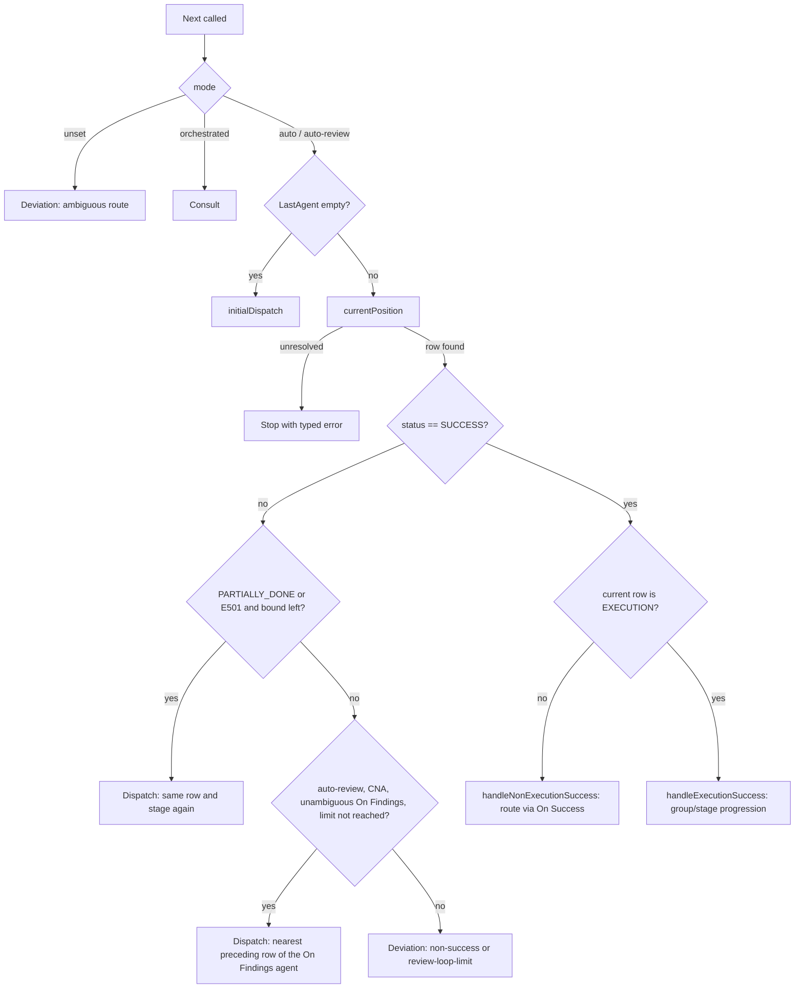

# engine

> Responsibility: The pure, side-effect-free decision core that answers "what happens next" for a run — given the admitted workflow, the stage set, the execution mode and the current artifact state, it decides whether to dispatch an agent, mark the run complete, hand the decision to the routing consultant, escalate a deviation, or stop.

## Overview

`engine` is the state machine at the heart of the runner. Every other package either feeds it inputs (workflow, stages, artifact state) or acts on its outputs (session, via dispatch/harness/artifact/consultation). It contains no I/O and no non-deterministic behavior — the same inputs always produce the same `EngineDecision`, which is what makes golden-file testing of full runs possible.

The package exposes:
- **`Next(NextInput)`** — the per-invocation router: given the state after the most recent agent response (or no prior response at all), decide the next step. All inputs, including the execution mode, the last step's written output artifacts and the artifact registry, arrive in `NextInput`.
- **`ResumePoint`** — a purely artifact-derived function used once when a run is resumed after a process restart: it reconstructs where execution left off, independent of `Next`.
- **`ResolveRowDefaults` / `ResolveArtifacts`** — the one routine that resolves a row's default input artifacts, output artifacts and HITL for a stage. The engine's own dispatch step and session's consultation-routed dispatches (and the manual routing dialogue's pre-checked lists) all use it, so a consulted dispatch defaults exactly like an engine-routed one.
- **`E501BudgetRemaining`, `PartiallyDoneRedispatchLimit`, `E501AttemptLimit`, `IsLastRowOfStage`, `IsLastRowOfPhase`** — shared helpers and bounds that session also reads.

Both `Next` and `ResumePoint` operate on the routing table shape produced by **compat** (`AdmittedWorkflow`) and the stage list produced by **planstages** (`StageSet`).

## Components / Subdomains

| Component | Purpose |
|-----------|---------|
| **Next / mode routing** (`engine.go`, `next_input.go`, `next_branches.go`) | Selects behaviour by `NextInput.Mode`, locates the row that just ran, and classifies the situation (first call, non-SUCCESS, non-EXECUTION SUCCESS, EXECUTION SUCCESS). |
| **Position derivation** (`position.go`) | Derives the current row and stage from the Execution Log entry of the step that just ran. Shared by `Next` and `ResumePoint`, so live routing and resume cannot disagree. |
| **Mechanical retry** (`retry.go`) | The bounded re-dispatch of a PARTIALLY_DONE or BLOCKED/E501 step in auto and auto-review modes. |
| **Review loop** (`next_branches.go`, `rowlookup.go`) | Auto-review route-back of a reviewer's findings and the review loop limit. |
| **Approach/group ordering** (`orderedGroupsForStage`, `computeNextFromExecution`) | Resolves which execution groups run and in what order for a stage by looking up the stage's `Approach` token in the workflow's `ApproachTable`; handles intra-/inter-stage advancement. |
| **Dispatch step construction** (`buildDispatchStep`, `row_defaults.go`, `artifacts.go`) | Builds the concrete `DispatchStep` (protocol request, effective HITL, resolved artifact paths, recorded phase and stage) for a target row. |
| **ResumePoint** (`resume.go`) | Reconstructs a `ResumeInfo` purely from `ArtifactState`, skipping trailing infrastructure entries. |

## Key Flows

### Next — mode first

1. **`ExecutionModeUnset`** (a programming error): returns a Deviation of kind `DeviationAmbiguousRoute`; never coerces to another mode.
2. **`orchestrated`**: the engine never routes. Every call, including the first of a new run, returns a **Consult** decision (`ConsultTriggerOrchestratedMode`) carrying the current row (`-1` on the first decision), phase and stage. Position-resolution errors are ignored here because the orchestrator reads the artifact itself.
3. **`auto` / `auto-review`**: the routing below.

```mermaid
flowchart TD
    A[Next called] --> M{mode}
    M -- unset --> DV[Deviation: ambiguous route]
    M -- orchestrated --> CO[Consult]
    M -- auto / auto-review --> B{LastAgent empty?}
    B -- yes --> C[initialDispatch]
    B -- no --> P[currentPosition]
    P -- unresolved --> ST[Stop with typed error]
    P -- row found --> D{status == SUCCESS?}
    D -- no --> R{PARTIALLY_DONE or E501 and bound left?}
    R -- yes --> RD[Dispatch: same row and stage again]
    R -- no --> F{auto-review, CNA, unambiguous On Findings, limit not reached?}
    F -- yes --> FB[Dispatch: nearest preceding row of the On Findings agent]
    F -- no --> G[Deviation: non-success or review-loop-limit]
    D -- yes --> H{current row is EXECUTION?}
    H -- no --> I[handleNonExecutionSuccess: route via On Success]
    H -- yes --> J[handleExecutionSuccess: group/stage progression]
```

Details for the auto modes:

1. **First call** (`state.CurrentState.LastAgent == ""`): `initialDispatch` picks the first pre-execution row if any exist, otherwise the first row of a non-staged workflow, otherwise the first row of stage 1's first ordered group. A staged workflow without a stage set stops, and the reason names the path the stage table was looked for (and whether it was supposed to be seeded).
2. **Non-SUCCESS response**, in this order: mechanical retry (below); in `auto-review` only, a COMPLETED_NEEDS_ACTION with an unambiguous On Findings hint (a plain agent identifier or `COMPLETE`, no spaces or parentheses) routes back, unless the review loop limit is reached; everything else returns a **Deviation** carrying the response and position. In `auto` mode COMPLETED_NEEDS_ACTION is always a deviation.
3. **SUCCESS on a non-EXECUTION row** (`handleNonExecutionSuccess`): routes via the row's `On Success` hint. `COMPLETE` ends the run; `next` advances by position (past the last row it completes); a named agent is resolved relative to the row that just ran — the nearest non-EXECUTION row after it, else before it, else the same search over any row — so a repeated agent identifier dispatches the intended row. An unambiguous hint that targets EXECUTION (named agent in a staged row, or `next` landing on one) means "enter EXECUTION": the actual first row comes from stage 1's approach-driven group ordering, not from the named agent's row. An ambiguous or absent hint, or a named agent with no other row, returns a Deviation (`DeviationAmbiguousRoute`).
4. **SUCCESS on an EXECUTION row** (`handleExecutionSuccess` / `computeNextFromExecution`): `On Success` is not consulted; advancement is by group and stage.

### Position derivation

`currentPosition` takes the last Execution Log entry of the exact instance recorded as `LastAgent` (or an entry synthesised from `current_state`, which records no row). `resolvePosition` then applies one rule for both live routing and resume:

- An entry that records a **workflow row** (`WorkflowRow`, the 1-based Row number) is positioned at that row for every row type, validated against the table: the row exists and holds the entry's agent; for a staged row the entry must also record a stage whose group is the row's group.
- Only an entry that records **no row** falls back to resolving by agent and phase: the first row with that agent and phase for a non-EXECUTION entry, the agent's single staged row for an EXECUTION entry.
- Nothing is ever guessed. The failures are `*domain.PositionUnresolvedError` with a cause: agent not a workflow participant, agent fills several EXECUTION rows and the entry records no row, recorded row invalid (outside the table, other agent, other group), or a staged row whose entry records no stage. `Next` turns it into a **Stop** decision whose `Err` carries the typed error (`Reason == Err.Error()`); `ResumePoint` returns it wrapped.

Recorded stages use the group form (`Test.1`, or `1` for a bare workflow, via `domain.FormatStageValue`); the legacy `Stage-N` form is still parsed. Recorded phases are the bare phase name (`EXECUTION`), never the table's qualified string.

### Mechanical retry (auto and auto-review)

`mechanicalRetry` re-dispatches the same row and stage (the step is marked `Retry`) for two cases, with all counting taken from the Execution Log:

- **PARTIALLY_DONE**: with k the length of the trailing run of PARTIALLY_DONE rows at the row and stage (rows with no recorded workflow row are skipped), re-dispatch while `k <= PartiallyDoneRedispatchLimit` (3) and deviate when k exceeds it. The re-dispatch hands over the previous output artifacts as inputs and appends the previous status message to the task description (`PartiallyDoneContextPrefix`). This bound is Runner-only; the native orchestrator policy has no cap.
- **BLOCKED with E501**: `E501BudgetRemaining` is `E501AttemptLimit` (3) minus the E501 rows at the row and stage since the last SUCCESS there; re-dispatch while it is above zero. The error code of the last step comes from the live response, or from the recorded log entry on resume.

In orchestrated mode neither applies: every such failure is a consultation.

### Review loop (auto-review)

On COMPLETED_NEEDS_ACTION with an unambiguous On Findings hint, `findingsRouteBack` dispatches the **nearest row above the reviewer's row** whose agent equals the hint (group and stage boundaries are disregarded; a staged reviewer keeps its stage). If no row above holds that agent the result is a Deviation. The dispatched step's inputs are the row's own, plus the reviewer's written output artifacts (`LastOutputArtifacts`), plus the target agent's own earlier outputs found in the artifact registry (matched against the step's resolved output paths), deduplicated with run-prefixed and unprefixed forms treated as equal. A SUCCESS-routed dispatch never carries injected artifacts.

`review_loop_limit` (0 = none, persisted in the artifact frontmatter) bounds this: `reviewLoopLimitReached` counts the reviewer's COMPLETED_NEEDS_ACTION rows keyed by reviewer, phase and stage (not by row) since that reviewer's last SUCCESS there. A COMPLETED_NEEDS_ACTION directly following the same reviewer's own COMPLETED_NEEDS_ACTION is a re-dispatch of the same round and is not counted again; a reviewer SUCCESS directly following its own COMPLETED_NEEDS_ACTION is a gate-discharging re-dispatch, not a pass, and does not reset the count. When the count reaches the limit the engine returns a Deviation of kind `DeviationReviewLoopLimit` instead of routing back.

### EXECUTION group/stage progression (`computeNextFromExecution`)

1. Determine the ordered group list for the current stage via `orderedGroupsForStage`. For bare workflows the approach is ignored and the single implicit group is returned. For grouped workflows the stage's `Approach` token is looked up verbatim and case-sensitively in the `ApproachTable`; no match returns `*domain.UnresolvableApproachError` (no default approach, no fallback).
2. If the current row is not the last of its group, advance within the group. A row that is in none of the ordered groups returns `*domain.RowNotInGroupError`.
3. If it is the last row of its group but another group remains in the stage, jump to the next group's first row.
4. If it is the last row of the last group, move to the next stage number in the `StageSet` (re-deriving group order from that stage's approach).
5. If no next stage exists, dispatch the first post-execution row if there is one; otherwise the run is `Complete`.

### ResumePoint — reconstructing position after a restart

Called once at run start, before the dispatch loop:

- It looks at the last **workflow** entry of the log, skipping trailing infrastructure entries (agents absent from the routing table and present in the `InfraAgentSet`). An entry that is neither a workflow participant nor infrastructure is a `PositionUnresolvedError`. No workflow entry at all means a fresh start from row 0.
- **Last workflow entry matches `CurrentState.LastAgent`**: clean completion; resume from the row after it — for a non-EXECUTION row that is the next positional row, or the entry point of EXECUTION (stage 1's first ordered group) exactly as live routing enters it; for an EXECUTION row it is `computeNextFromExecution`.
- **Last workflow entry does NOT match**: the process died mid-invocation; `ResumeInfo.RerunLast` is set and the same row is re-dispatched.
- Position resolution uses the same recorded-row rule as `Next`; an entry whose row cannot be identified is an error, never a guess.

### Dispatch step construction

`buildDispatchStep` assembles the `DispatchStep` for a row:
- **Effective HITL** = row-level HITL OR (for a staged row) that stage's HITL flag from the `StageSet`.
- **Artifact paths** (`ResolveArtifacts`): `{StageNumber}` is substituted with the stage number (a staged context is required, otherwise an unresolvable-template error becomes a `Stop`). `Stage-*` in **input** artifacts expands to one path per stage in the effective stage set (the refreshed set when the row is non-EXECUTION and one is available); in **output** artifacts it is passed through unexpanded.
- **Agent instance ID** is `{agentIdentifier}#{seq+1}`.
- The step records `Phase` (bare name) and `Stage` (group form) for the artifact.

## Relationships

| Talks To | For |
|----------|-----|
| **domain** | Sole internal import — all types (`AdmittedWorkflow`, `StageSet`, `ArtifactState`, `ProtocolResponse`, `EngineDecision` and its variants, `ResumeInfo`, `WorkflowRow`) come from here. `engine` imports nothing else internal and no I/O packages. |
| **session** | The exclusive consumer. Session calls `ResumePoint` once at run-start, then `Next` in a loop, translating each `EngineDecision` into I/O. It also calls `ResolveRowDefaults`, `E501BudgetRemaining` and the last-row helpers. |
| **compat** (indirect, via inputs) | Supplies the `AdmittedWorkflow` shape (row ranges, `Groups`, `GroupsDeclared`, `ApproachTable`, `HasStagedPhase`). |
| **planstages** (indirect, via inputs) | Supplies the `StageSet` (`Approach` and HITL per stage). |

## Key Concepts

| Concept | Meaning |
|---------|---------|
| **EngineDecision** | Exactly one of `Dispatch`, `Complete`, `Deviation`, `Consult`, `Stop` is non-nil. |
| **Consult vs. Deviation** | Both end in the same session routine and a consultation request. A Deviation means the engine tried and could not decide; a Consult means it was never entitled to decide (orchestrated mode). |
| **Unambiguous hint** | An `On Success`/`On Findings` value is unambiguous when the column is present, non-empty, and contains no spaces or parentheses — a bare agent identifier or a reserved keyword (`COMPLETE`, `next`). |
| **On Success is ignored inside EXECUTION** | Routing between EXECUTION rows is governed entirely by group/stage/approach progression. |
| **Deviation kinds** | `DeviationNonSuccess` (non-SUCCESS without a usable retry or route-back), `DeviationAmbiguousRoute` (unresolvable On Success hint, or unset mode), `DeviationReviewLoopLimit` (auto-review limit reached), `DeviationHarnessError` (declared in domain, never produced inside `engine`; session raises it when a consultation-routed HITL re-dispatch hits a harness error). |
| **Interruption / RerunLast** | Detected by `ResumePoint` when the last workflow log entry's agent differs from `CurrentState.LastAgent`; the interrupted row is re-dispatched rather than advanced past. |

## Boundaries

- **Owns:** the routing decision logic — what row runs next, in what order, with what effective HITL and resolved artifact paths; the mechanical retry bounds; the review loop limit; position derivation from the log; resume-position reconstruction.
- **Does Not Own:** parsing or validating the workflow/stage/artifact inputs; performing dispatch, I/O or clock reads (session and its adapters); resolving a Consult or Deviation (session and `deviation`); anti-loop protection of consultant-requested dispatches (session); constructing `AgentReference` values (agentresolve).

## Invariants & Conventions

- No I/O, no filesystem/network/random access, no `time.Now()` anywhere in this package — the `time.Time` in `NextInput` is accepted but not inspected by any routing logic.
- Exactly one field of `EngineDecision` is non-nil per call. `DispatchDecision.Steps` always holds exactly one element.
- `On Success` is never consulted while routing within EXECUTION; `On Findings` is only consulted for COMPLETED_NEEDS_ACTION in `auto-review`.
- Row and stage always come from the recorded `WorkflowRow` when the log entry has one; a mismatch between the entry and the table is an error, not a fallback.
- Mechanical retries are counted from the Execution Log, never from in-memory state, so they hold across a restart.

## Known Complexity

The position derivation (`position.go`) and the review loop counting (`reviewLoopLimitReached`) are the most intricate parts; both are described above and covered by dedicated test files in the package. No deeper-tier document is recommended.
